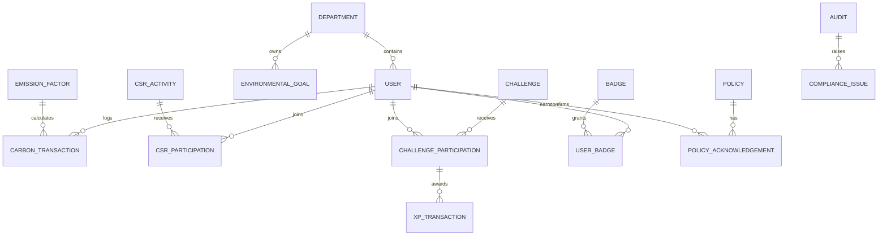

# Database Design

## Entity model

## Tables and key fields

| Model | Required fields / constraints |
|---|---|
| User | id UUID, email unique, passwordHash, name, role, departmentId, totalXp default 0, level default `SPROUT`, active |
| Department | id, name unique, code unique, parentId nullable, headUserId nullable |
| EmissionFactor | id, name, category, unit, factorKgCo2e Decimal, effectiveFrom, active; unique(name,effectiveFrom) |
| CarbonTransaction | id, departmentId, factorId, createdById, source, description, quantity Decimal > 0, calculatedKgCo2e Decimal, occurredOn, status |
| EnvironmentalGoal | id, departmentId, name, targetKgCo2e > 0, currentKgCo2e, deadline, status |
| CsrActivity / CsrParticipation | activity has title/date/maxParticipants/status; participation unique(userId,activityId), evidencePath, approvalStatus, points |
| Challenge / ChallengeParticipation | challenge has difficulty, xpReward, evidenceRequired, start/end/status; participation unique(userId,challengeId), status, proofPath, reviewerId, reviewedAt, feedback |
| XpTransaction | id, userId, participationId unique nullable, baseXp, bonusXp, reason, awardedAt; append-only |
| Badge / UserBadge | badge code unique, criteriaType/value; user badge unique(userId,badgeId) |
| Policy / PolicyAcknowledgement | policy title/version unique; acknowledgement unique(userId,policyId) |
| Audit / ComplianceIssue | audit title/date/auditor/status; issue has severity, status, ownerId, opened/resolved dates |
| ReportRun | id, userId, type, filters JSON, format, generatedAt, filePath nullable |

Every model has `createdAt`, `updatedAt`; transactional models also retain `createdById` where useful. Use UUID primary keys. Index: foreign keys, `CarbonTransaction(occurredOn, departmentId)`, active status fields, `ChallengeParticipation(status)`, `ComplianceIssue(status,severity)`.

## Critical transactional rules

- On carbon create: snapshot `factorKgCo2e` and calculate `quantity × factorKgCo2e`; never recalculate historical records after factor edits.
- Approval executes one database transaction: transition proof to `APPROVED`, insert one unique XP transaction, increment user XP, evaluate badges. Repeated approval must return 409.
- A rejected challenge becomes `REJECTED` and keeps its membership/proof record so the employee can resubmit.
- Seed: Admin `admin@ecospher.demo`, ESG manager, HR, Compliance, and three employees across Manufacturing, Logistics and Corporate. Password for demo only: `Demo@123`.
